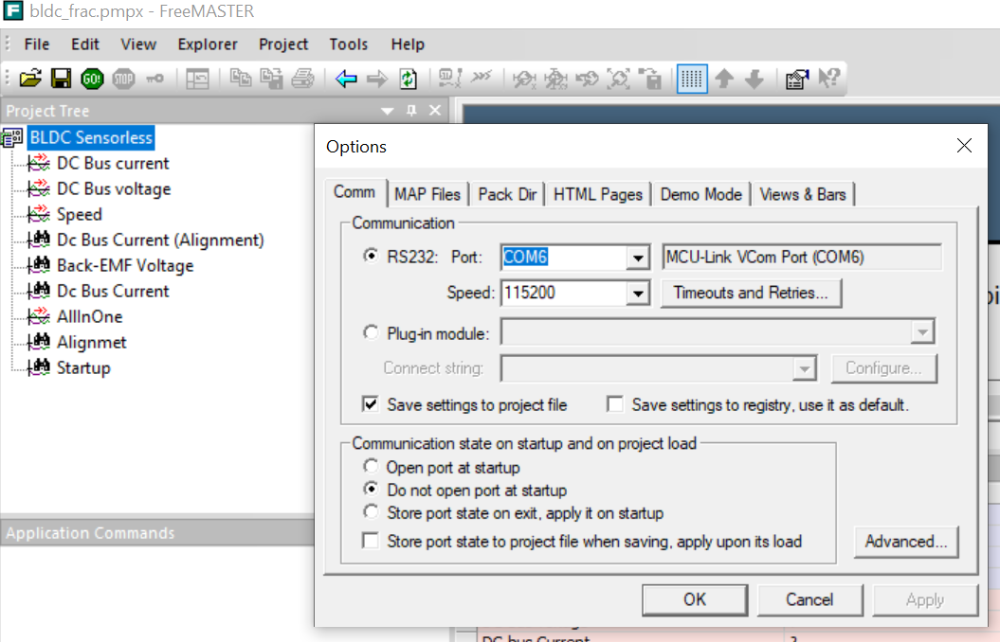
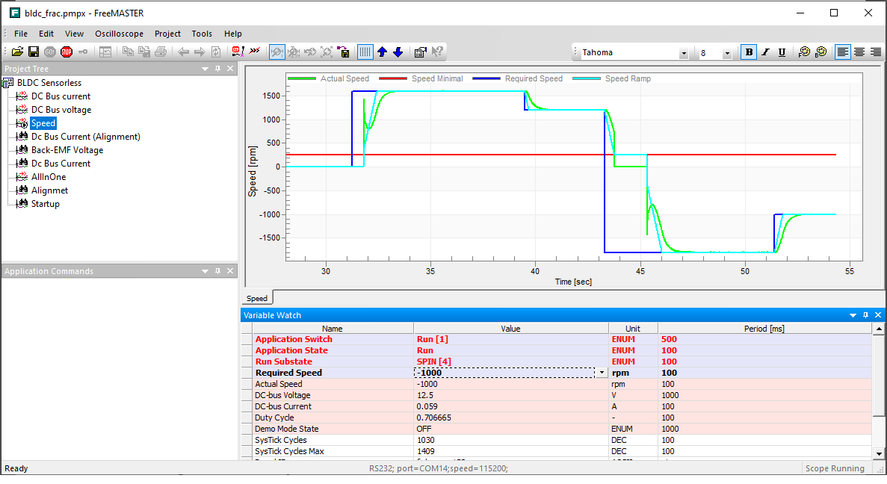

# NXP Application Code Hub

## Sensorless BLDC motor control on KE17Z

This application note demonstrates how to implement the six-step commutation control of brushless direct current(BLDC) motor on KE17Z512 and KE17Z256 MCUs.  
The repository contains two project "an-mc-bldc-ke17z256" and "an-mc-bldc-ke17z512". The project for KE17Z256 can be imported from folder "an-mc-bldc-ke17z256" and the project for KE17Z512 can be imported from folder "an-mc-bldc-ke17z512".  
The NXP Freedom board FRDM-MC-LVBLDC is used as a hardware platform for the motor control reference solution. 

#### Boards: FRDM-KE17Z, FRDM-KE17Z512
#### Categories: Motor Control
#### Peripherals: PWM, ADC
#### Toolchains: MCUXpresso IDE
#### SDK: SDK_2_15_000_FRDM-KE17Z / SDK_2_14_1_FRDM-KE17Z512

## Table of Contents
1. [Software](#step1)
2. [Hardware](#step2)
3. [Setup](#step3)
4. [Results](#step4)
5. [FAQs](#step5) 
6. [Support](#step6)
7. [Release Notes](#step7)

## 1. Software
- Download and install [MCUXpresso IDE V11.9.0 or later](https://www.nxp.com/design/design-center/software/development-software/mcuxpresso-software-and-tools-/mcuxpresso-integrated-development-environment-ide:MCUXpresso-IDE).
- Download and install the latest version of [FreeMASTER](https://www.nxp.com/design/software/development-software/freemaster-run-time-debugging-tool:FREEMASTER)(3.2.2.2).
- Download the code from Git repository: an-mc-bldc-ke17z.  
- MCUXpresso for Visual Studio Code: This example supports MCUXpresso for Visual Studio Code, for more information about how to use Visual Studio Code please refer [here](https://www.nxp.com/design/training/getting-started-with-mcuxpresso-for-visual-studio-code:TIP-GETTING-STARTED-WITH-MCUXPRESSO-FOR-VS-CODE).

## 2. Hardware
- [FRDM-KE17Z](https://www.nxp.com/design/design-center/development-boards-and-designs/general-purpose-mcus/freedom-development-platform-for-72mhz-ke17z-ke13z-ke12z-mcus:FRDM-KE17Z)/[FRDM-KE17Z512](https://www.nxp.com/design/design-center/development-boards-and-designs/general-purpose-mcus/frdm-development-board-for-96-mhz-ke17z-ke13z-ke12z-with-512-kb-flash-mcus:FRDM-KE17Z512) Development Board.
- [FRDM-MC-LVBLDC](https://www.nxp.com/design/design-center/development-boards/general-purpose-mcus/nxp-freedom-development-platform-for-low-voltage-3-phase-bldc-motor-control:FRDM-MC-LVBLDC).
- [LINIX 45ZWN24 motor](https://www.nxp.com/design/development-boards/freedom-development-boards/mcu-boards/low-voltage-3-phase-motor-for-frdm-platform:FRDM-MC-LVMTR).
- Personal Computer
- USB cable and 12V adaptor.

## 3. Setup

### 3.1 Step 1
1. Open MCUXpresso IDE, in the Quick Start Panel, choose **Import from Application Code Hub**

   
2. Enter the demo name in the search bar.

   
3. Click **Copy GitHub link**, MCUXpresso IDE will automatically retrieve project attributes, then click **Next>**.

   
4. Select **main** branch and then click **Next>**, Select the MCUXpresso project, click **Finish** button to complete import.

   
5. Click **Build** to start compiling the project.

   

### 3.2 Step 2

Connect the **FRDM-MC-LVBLDC** shield to the **J1~J4** arduino connector of **FRDM-KE17Z/FRDM-KE17Z512** board. Connect the 3-phase wire of the motor to the J7 connector on FRDM-MC-LVBLDC according to phase sequence(**White** wide--phase**A**; **Bule** wide--phase**B**; **Green** wide--phase**C**). Power the FRDM-MC-LVBLDC board with a 12V adaptor.  

Compile the project and use a USB cable to connect to the FRDM board. Use MCU-LINK to download program into MCU.

### 3.3 Step 3

Compile the project and download program into MCU.  Press SW2 on FRDM board to control the motor to run or stop. Or use FreeMASTER project **"bldc_frac.pmpx"** in the code package to control the motor, change rotor speed and obverse the speed or other value.

## 4. Results

The FreeMASTER can be used to completely control the motor control application. The operation in FreeMASTER are described more closely here.
Select the right com in FreeMASTER project, in Project->Options-Comm:  
  
Operation state and speed command can be configured in FreeMASTER.  
  

## 5. FAQs
No FAQs have been identified for this project.

## 6. Support
*Provide URLs for help here.*

#### Project Metadata
<!----- Boards ----->
 

<!----- Categories ----->

<!----- Peripherals ----->
 

<!----- Toolchains ----->

Questions regarding the content/correctness of this example can be entered as Issues within this GitHub repository.

>**Warning**: For more general technical questions regarding NXP Microcontrollers and the difference in expected funcionality, enter your questions on the [NXP Community Forum](https://community.nxp.com/)

## 7. Release Notes
| Version | Description / Update                           | Date                        |
|:-------:|------------------------------------------------|----------------------------:|
| 1.0     | Initial release on Application Code Hub        | March 26th 2024 |

